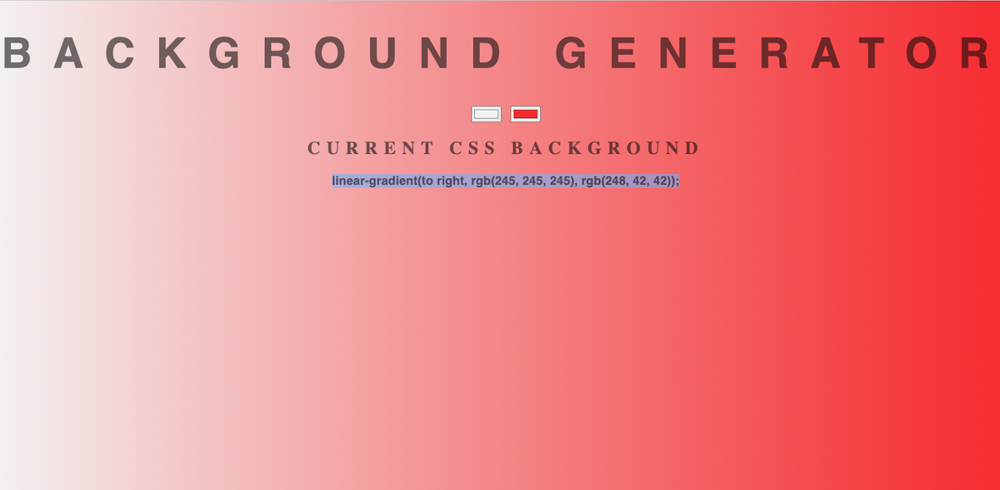

# Background-generator
This application help user to select an appropriate combination of colors for the background.

You can navigate to the deployed application <a href="https://mihaelavalac.github.io/background-generator/" target="_blank">here.</a>

Select your preferred colors in the color picker rectangles. 

To add the color to your background:
1. copy the linear-gradient output from the application.
2. add it to your background in the style sheet. 
3. like this:
```
body {
  background: linear-gradient(to right, rgb(245, 245, 245), rgb(248, 42, 42)); 
}
```

4. the background mentioned in the above command will lock like this:


